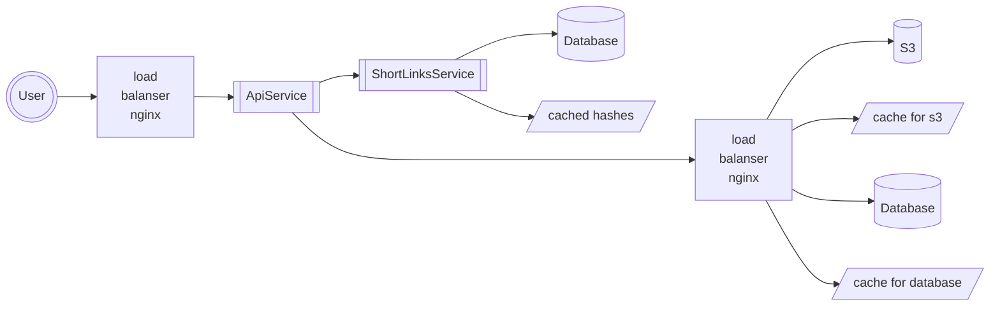

## Description
Система, в которой пользователи могут создавать открытки.
*Открытка* - блок текста (с картинкой?)
## Features
- Пользователь может создать открытку и загрузить в систему
- В ответ при создании пользователь получает ссылку на открытку
- Просмотр открытки никак не ограничен (любой человек, даже не пользователь, может просмотреть открытку по ссылке)
- Открытка деактивируется и удаляется из системы через параметризированное время
- Ссылка должна содержать уникальный короткий хэш
## Keep in mind
- Некоторые открытки гораздо популярнее других
- Некоторые пользователи создаю открытки гораздо чаще
## Stack
- java
- spring
- postgre sql
- s3
- redis
- nginx
## System diagram

